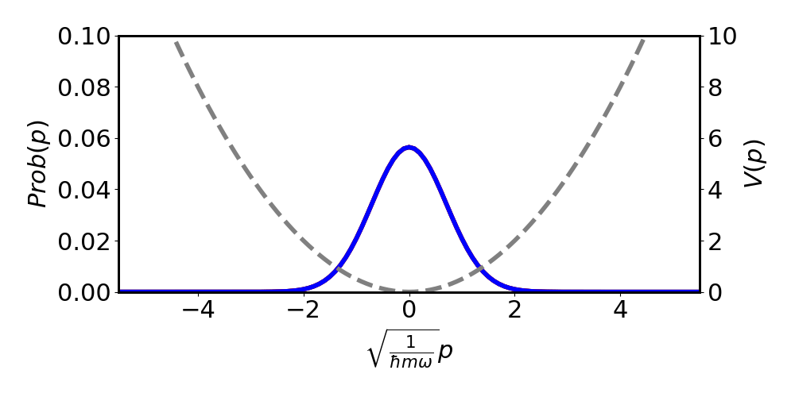

# Measurement-based Feedback Control

This code repository contains code to create plots and data for the paper "Measurement-based Feedback Control of a Quantum System in a Harmonic Potential"

Tested on python 3.10.

Please cite our work if you use this code:
```bibtex
@article{rouillard2022measurement,
  title={Measurement-based feedback control of a quantum system in a harmonic potential},
  author={Rouillard, Amy and Reddy, Anirudh and Bassa, Humairah and Maharaj, Shamik and Diosi, Lajos and Konrad, Thomas},
  journal={arXiv preprint arXiv:2212.12292},
  year={2022}
}
```

# Animations

Animations showing the evolution of three wave functions under different measurement and feedback conditions, namely without measurement or feedback (black), with measurement but no feedback (red), and with both measurement and feedback (blue). The solid lines represent the probability distribution of momentum measurements, while the dashed lines indicate the corresponding potential energy due to feedback.




